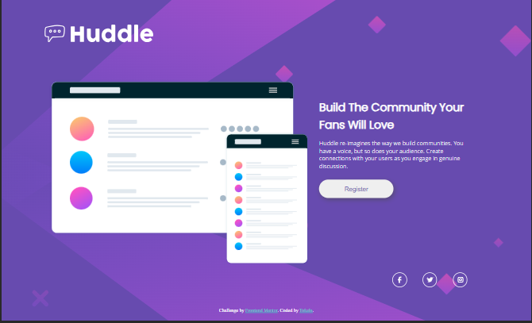

# Frontend Mentor - QR code component

This is a solution to the [Huddle landing page with single introductory section challenge on Frontend Mentor](https://www.frontendmentor.io/challenges/huddle-landing-page-with-a-single-introductory-section-B_2Wvxgi0). Frontend Mentor challenges help you improve your coding skills by building realistic projects. 

## Table of contents

- [Overview](#overview)
    - [The challenge](#the-challenge)
  - [Screenshot](#screenshot)
  - [Links](#links)
- [My process](#my-process)
  - [Built with](#built-with)
  - [What I learned](#what-i-learned)
  - [Author](#author)

## Overview

### The challenge

Users should be able to:

- View the optimal layout for the page depending on their device's screen size
- See hover states for all interactive elements on the page

### Screenshot
  
   

### Links

- Solution URL: [GitHub code solution URL](https://github.com/Kennedy-was-taken/landing-page-with-single-introductory)
- Live site Url : [Vercel QR code app](landing-page-with-single-introductory.vercel.app)

### Built with

- Semantic HTML5 markup
- CSS custom properties
- Flexbox
- Grid
- Mobile-first workflow
- @media
- Angularjs
- JavaScript
- TypeScript

### What I learned
- Throughout the development of this project, I gained valuable insights into using @media queries to provide screen support for various devices. Specifically, I set breakpoints at 374px for mobile devices and 1440px for desktop devices. However, when attempting to deploy the project on GitHub Pages, I encountered several failures.

- After some consideration, I opted to switch platforms and decided to try Vercel. The experience with Vercel was seamless from start to finish. I began by setting up an account, installing the Vercel Command Line Interface (CLI), and configuring my Angular app for deployment. The deployment process involved running the 'vercel' command in the same directory as the Angular project in the terminal.

- It's worth noting that, despite the availability of a graphical interface, my preferred method for deploying the app in a production environment remains using the Vercel CLI for its efficiency and control.

## Author

- Github Profile: [Kennedy-was-taken](https://github.com/Kennedy-was-taken)
- Frontend Mentor : [@Kennedy-was-taken](https://www.frontendmentor.io/profile/Kennedy-was-taken)